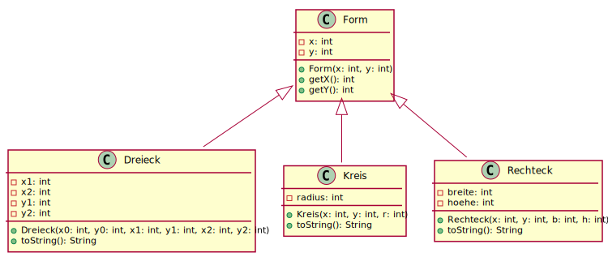

_Übungsaufgabe zur Veranstaltung [Programmieren 2](https://hsro-wif-prg2.github.io) im [Bachelorstudiengang Wirtschaftsinformatik](https://www.fh-rosenheim.de/technik/informatik-mathematik/wirtschaftsinformatik-bachelor/) an der [Hochschule Rosenheim](http://www.fh-rosenheim.de)._


# Übung 9: Vererbung

In dieser Übung befassen wir uns mit den beiden Modellierungsstrategien _bottom-up_ und _top-down_, wie in der Vorlesung besprochen.


## Bottom-Up: Refactoring

Gegeben ist das Paket `ueb09.fz`, sowie die bereits modellierten Klassen `Fahrrad`, `Motorrad`, `Auto` und `Lastwagen`, sowie die Teile `Cantileverbremse`, `Scheibenbremse` und `Trommelbremse`.

1. Analysieren Sie die Klassen und suchen Sie nach Gemeinsamkeiten bzw. Verschiedenheiten.
2. Entwerfen Sie eine geeignete Klassenhierarchie in UML; was sind geeignete Oberklassen bzw. Schnittstellen?
3. Implementieren Sie die modellierten Komponenten und passen Sie die bestehenden Klassen entsprechend an; achten Sie dabei insbesondere auf die korrekte Verwendung von Konstruktoren.

> Hinweis: Es bietet sich eine mehrschichtige Klassenhierarchie für die Fahrzeuge sowie eine Schnittstelle für die Bremsen an.


## Top-Down: Modellierung einer Klassenhierarchie

Für das Programm `ueb09.gf.Zeichenprogramm` sollen Kreise, Dreiecke und Rechtecke modelliert werden.
Diese sollen später in einem X/Y-Koordinatensystem gezeichnet werden.

1. Welche Attribute sind für alle Formen nötig, welche sind speziell? Welche Attribute kann man berechnen, welche müssen vorgegeben werden?
2. Zeichnen Sie ein UML Diagramm der Ihrer Klassenhierarchie.
3. Implementieren Sie Ihre Klassenhierarchie.
	Implementieren Sie für jede Klasse die `toString` Methode; achten Sie insbesondere auf die korrekte Verwendung von Konstruktoren.
4. Vervollständigen Sie die `main` Methode der Klasse Zeichenprogramm gemäß der Kommentare.

Beispielausgabe des fertigen Programms:

```
Kreis um (5, 10) mit Radius 5
Rechteck von (0, 0) bis (3, 2) mit Breite 3 und Höhe 2
Dreieck an (0, 0), (1, 0) und (0, 1) mit Seitenlängen 1, 1 und 1.4142135623730951.
```


